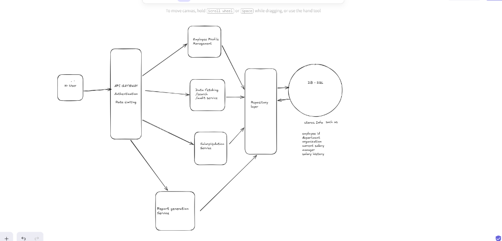

# Product Requirements Document & High-Level System Architecture
**Project:** CompPulse — Enterprise Salary Management Tool  
**Author:** Diya Khandelwal  
**Target Persona:** HR Manager (Head of Total Rewards)  
**Date:** September 2026  
**Status:** Approved & Implemented  

---

## 1. Executive Summary & Product Objective
Modern enterprises require clear visibility into their global compensation structures to maintain market competitiveness, ensure departmental and geographic parity, and responsibly govern salary revisions. **CompPulse** is a specialized, end-to-end Salary Management platform designed explicitly for an **HR Manager persona**. It provides real-time compensation analytics, multi-criteria employee search, auditable salary revision workflows with live delta modeling, and historical compensation tracking across international entities.

---

## 2. Core User Persona
* **Persona Name:** Elena Vance, Head of People & Total Rewards (HR Manager)
* **Key Goals:**
  1. Understand organizational salary spend across departments and countries.
  2. Simulate and execute salary revisions with percentage increase calculations and reason capture.
  3. Inspect chronological revision histories to ensure fair compensation progression.
  4. Ensure compliance through an immutable audit trail of all profile and compensation changes.

---

## 3. Scope Boundary: Deliberate Decisions & Trade-Offs

The scope of this solution was intentionally refined following direct requirements alignment with recruiting leadership. The deliberate trade-offs are summarized below:

| Functional Area | Scope Decision | Product Rationale & Engineering Justification |
| :--- | :--- | :--- |
| **Payroll Processing** | ❌ **OUT OF SCOPE** (Deliberately Excluded) | Payroll processing deals with transactional disbursements, local statutory tax withholding (W-2, PAYE, TDS), and social security deductions (PF/ESI/401k). The prompt centers on **compensation management** (how the organization pays people and plans budgets), not payroll operations. Omitting payroll prevents regional tax engine bloat while retaining high analytical signal. |
| **Approval Workflow** | ❌ **OUT OF SCOPE** (Multi-Tier Hierarchies Excluded) | Multiple approval tiers (L1 Manager → L2 Director → VP Finance) were clarified as unnecessary. A single HR Manager persona was confirmed. Eliminating approval queue state machines allows a streamlined, frictionless UX while capturing approver identity in the audit trail. |
| **HRMS Integrations** | ❌ **OUT OF SCOPE** (External APIs Excluded) | Syncing with Workday, BambooHR, or ADP requires third-party API keys and sandbox network dependencies. Keeping the data layer self-contained in a relational SQL database ensures zero-config portability and testability. |
| **Advanced RBAC** | ❌ **OUT OF SCOPE** (Multi-Role Permissions Excluded) | Multiple user roles (Employee self-service, Finance view-only, Payroll clerk) are omitted. A unified HR Manager session simplifies access control while strictly enforcing rate limiting at the API Gateway. |
| **Salary Revision History** | ✅ **IN SCOPE** (Included as High-Value Feature) | Although marked optional, maintaining a chronological revision timeline (with previous vs. new base, bonus, % change, reason, and notes) is essential for compensation governance and demonstrates end-to-end domain maturity. |
| **Audit Logging** | ✅ **IN SCOPE** (Included as High-Value Feature) | An immutable audit log records all modifications, capturing action types (`UPDATE_SALARY`, `CREATE_EMPLOYEE`), actor attribution, timestamps, and payload diffs for complete governance. |
| **Analytics & Reporting** | ✅ **IN SCOPE** (Focused Total Rewards Analytics) | Total annual payroll, headcount, median & mean salary, min/max spread, department expenditure, country distribution, and compensation band histograms with one-click CSV export. |

---

## 4. High-Level Architecture (HLD Blueprint)

Implemented directly in accordance with the whiteboard architectural design:

<p align="center">
  
</p>

```
+-----------------------------------------------------------------------------------+
|                                 HR USER (CLIENT)                                  |
|                      React 19 + TypeScript (Vite + Vanilla CSS)                    |
+------------------------------------------+----------------------------------------+
                                           |  HTTPS / REST / JSON
                                           v
+-----------------------------------------------------------------------------------+
|                                API GATEWAY LAYER                                  |
|   • HR Persona Authentication Filter ("Elena Vance", X-HR-User-Role)              |
|   • Sliding Window Rate Limiting Filter (180 requests / minute / IP)              |
|   • CORS Configuration & Global Exception Handling Advice                         |
+------------------------------------------+----------------------------------------+
                                           |
    +------------------+-------------------+------------------+------------------+
    |                  |                                      |                  |
    v                  v                                      v                  v
+-----------+  +----------------------------+  +-------------------+  +--------------+
| Employee  |  | Data Fetching / Search /   |  |  Salary Updation  |  |    Report    |
|  Profile  |  | Audit Service              |  |      Service      |  |  Generation  |
|Management |  | • Multi-Attribute Search   |  | • Delta & % Calc  |  |   Service    |
| • CRUD    |  | • Dept / Country Filtering |  | • Revision Logs   |  | • KPIs & Dist|
| • Depts   |  | • Pagination & Sorting     |  | • History Timeln  |  | • Dept/Region|
| • Status  |  | • Immutable Audit Trail    |  | • Reason Tracking |  | • CSV Export |
+-----+-----+  +-------------+--------------+  +---------+---------+  +-------+------+
      |                      |                           |                    |
      +----------------------+-------------+-------------+--------------------+
                                           |
                                           v
+-----------------------------------------------------------------------------------+
|                             REPOSITORY & DATA LAYER                               |
|        Spring Data JPA • Hibernate ORM • Type-Safe Queries & Aggregations         |
+------------------------------------------+----------------------------------------+
                                           |
                                           v
+-----------------------------------------------------------------------------------+
|                               RELATIONAL SQL DATABASE                             |
|  • Employees (id, code, names, dept, org, country, currency, base, bonus, status) |
|  • Salary Revisions (id, emp_id, prev_base, new_base, %_change, reason, date)     |
|  • Audit Logs (id, entity_type, entity_id, action, actor, diff_details, timestamp)|
|                                                                                   |
|  Default: Embedded H2 (Zero-Setup Local Dev) | Cloud: PostgreSQL (Render / Prod)  |
+-----------------------------------------------------------------------------------+
```

---

## 5. Technology Stack
* **Backend:** Java 21 / 24, Spring Boot 3.4.3, Gradle 8.12.1 (`build.gradle`), Spring Data JPA, Hibernate, Jakarta Validation.
* **Frontend:** React 19, TypeScript, Vite, Vanilla CSS Design System with CSS Custom Properties, Lucide Icons.
* **Database:** Embedded H2 Database with in-memory persistence and web console (`/h2-console`); PostgreSQL production compatibility.
* **DevOps & Deployment:** Docker multi-stage builds, `docker-compose.yml`, `render.yaml` for free cloud deployment.

---

## 6. Success Metrics & Verification
1. **Compilation & Type Safety:** Clean compilation for both Java backend (Gradle: `./gradlew bootJar` / `gradlew build`) and React TypeScript frontend (`tsc -b && vite build`).
2. **Deterministic Seed State:** Pre-populated realistic roster of 20 international profiles with historic revisions to enable instant demonstration.
3. **Responsive UI:** Fluid execution on desktop and mobile displays with sub-50ms frontend responsiveness and real-time revision delta previews.
